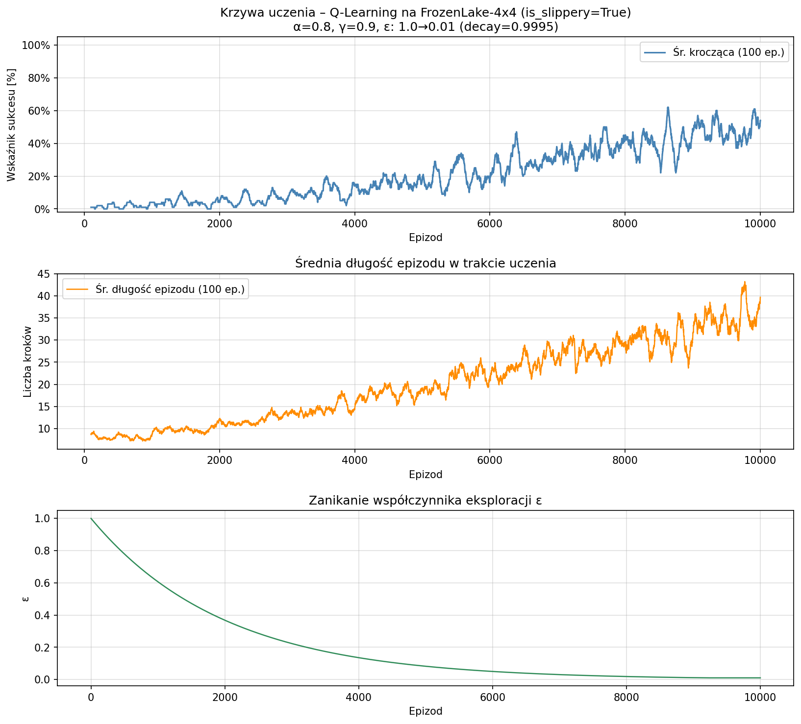
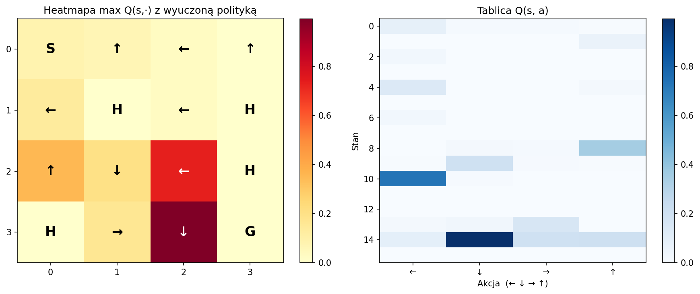

# Sprawozdanie - Projekt 3: Podstawy Gymnasium, zadanie na 4 punkty
**Algorytm:** Q-Learning z eksploracją ε-greedy  
**Środowisko:** FrozenLake-v1

---

## 1. Opis środowiska

Środowisko **FrozenLake-v1** z pakietu `gymnasium` symuluje poruszanie się po zamarzniętym jeziorze o siatce 4×4. Agent startuje z pola S i stara się dotrzeć do pola G (cel) bez wpadnięcia w dziury H. Przestrzeń stanów jest dyskretna i liczy 16 stanów, a przestrzeń akcji zawiera 4 ruchy: LEFT (0), DOWN (1), RIGHT (2), UP (3).

```
S F F F
F H F H
F F F H
H F F G
```

| Symbol | Znaczenie |
|--------|-----------|
| S | Start (stan 0) |
| F | Frozen - bezpieczne pole lodowe |
| H | Hole - dziura, epizod kończy się porażką (nagroda = 0) |
| G | Goal - cel, epizod kończy się sukcesem (nagroda = 1) |

Kluczową cechą zastosowanej konfiguracji jest parametr **`is_slippery=True`**, który wprowadza stochastyczność środowiska: gdy agent wybiera daną akcję, z prawdopodobieństwem 1/3 wykonuje ją zgodnie z zamierzeniem, a z prawdopodobieństwem 2/3 przesuwa się prostopadle (po 1/3 na każdą stronę). Oznacza to, że środowisko jest **niedeterministyczne** - ten sam stan i akcja mogą prowadzić do różnych stanów następnych. Jest to realistyczna i trudniejsza wersja problemu, w odróżnieniu od wersji deterministycznej (`is_slippery=False`).

---

## 2. Algorytm Q-Learning

### 2.1 Podstawy teoretyczne

Zastosowano algorytm **Q-Learning** - klasyczny algorytm uczenia ze wzmocnieniem z kategorii metod off-policy. Algorytm uczy się funkcji wartości akcji Q(s, a), która reprezentuje oczekiwaną zdyskontowaną nagrodę sumaryczną, jaką agent może osiągnąć, rozpoczynając ze stanu *s*, wykonując akcję *a*, a następnie postępując zgodnie z optymalną polityką.

Aktualizacja tablicy Q odbywa się zgodnie z **równaniem Bellmana**:

$$Q(s, a) \leftarrow Q(s, a) + \alpha \left[ r + \gamma \max_{a'} Q(s', a') - Q(s, a) \right]$$

gdzie:
- $Q(s, a)$ - bieżąca wartość stanu-akcji
- $\alpha$ - współczynnik uczenia (learning rate)
- $r$ - natychmiastowa nagroda otrzymana po wykonaniu akcji $a$ w stanie $s$
- $\gamma$ - **współczynnik dyskontowy** (ustawiony na **0.9**)
- $s'$ - stan następny po wykonaniu akcji
- $\max_{a'} Q(s', a')$ - maksymalna wartość Q dla stanu następnego (bootstrapping)

Wyrażenie w nawiasach $\left[ r + \gamma \max_{a'} Q(s', a') - Q(s, a) \right]$ nosi nazwę **błędu TD** (temporal difference error) - mierzy różnicę między aktualnym oszacowaniem a lepszym oszacowaniem wynikającym z otrzymanej nagrody i przyszłych wartości.

Współczynnik dyskontowy γ = 0.9 oznacza, że agent ceni przyszłe nagrody, ale nieco mniej niż nagrody bezpośrednie. Nagroda oddalona o *k* kroków jest ważona współczynnikiem $0.9^k$, co zachęca agenta do znajdowania krótszych ścieżek do celu.

### 2.2 Strategia eksploracji: ε-greedy

Aby równoważyć eksplorację nowych ścieżek z eksploatacją nabytej wiedzy, zastosowano politykę **ε-greedy**:

- z prawdopodobieństwem ε agent wybiera losową akcję (**eksploracja**)
- z prawdopodobieństwem (1 - ε) agent wybiera akcję z najwyższą wartością Q (**eksploatacja**)

Wartość ε maleje wykładniczo w trakcie treningu:

$$\varepsilon_{t+1} = \max(\varepsilon_{\min},\; \varepsilon_t \cdot d)$$

gdzie $d = 0.9995$ to współczynnik zaniku. Dzięki temu agent stopniowo przechodzi od pełnej eksploracji (ε = 1.0) do niemal czystej eksploatacji (ε → 0.01).

---

## 3. Implementacja

### 3.1 Środowisko i tablica Q

Środowisko tworzone jest z użyciem `gymnasium.make("FrozenLake-v1", map_name="4x4", is_slippery=True)`. Tablica Q inicjalizowana jest zerami o wymiarach (16 stanów × 4 akcje). Zerowa inicjalizacja jest neutralna i właściwa dla środowisk z nagrodami nieujemnymi.

### 3.2 Pętla treningowa

W każdym epizodzie:
1. Środowisko jest resetowane do stanu S (z unikalnym seedem dla reprodukowalności)
2. W każdym kroku agent wybiera akcję zgodnie z polityką ε-greedy
3. Środowisko zwraca stan następny $s'$, nagrodę $r$ i flagę zakończenia
4. Tablica Q jest aktualizowana regułą Bellmana
5. Przy zakończeniu epizodu (wpadnięcie w dziurę lub osiągnięcie celu) pętla kroków zostaje przerwana
6. Wartość ε jest redukowana

Trening obejmuje **10 000 epizodów** z maksymalnie 100 krokami na epizod.

### 3.3 Hiperparametry

| Parametr | Wartość | Opis |
|----------|---------|------|
| Epizody | 10 000 | Łączna liczba epizodów treningowych |
| Max kroków | 100 | Maksymalna długość epizodu |
| α (learning rate) | 0.8 | Szybkość aktualizacji tablicy Q |
| **γ (discount)** | **0.9** | Współczynnik dyskontowy |
| ε startowe | 1.0 | Pełna eksploracja na początku |
| ε minimalne | 0.01 | Dolna granica eksploracji |
| ε decay | 0.9995 | Wykładnicze zanikanie ε na epizod |

---

## 4. Eksperymenty i wyniki

### 4.1 Krzywa uczenia

Poniżej przedstawiono krzywą uczenia (wygładzona średnia krocząca z oknem 100 epizodów), długość epizodów oraz zanikanie ε w trakcie treningu.



Wykres pokazuje trzy wyraźne fazy uczenia:

1. **Faza eksploracji (ep. 1-3000):** Wskaźnik sukcesu jest niski (1-6%). Agent eksploruje środowisko niemal losowo - wartości Q są dopiero budowane, a ε jest wysokie (0.74 po 3000 ep.).

2. **Faza przejściowa (ep. 3000-7000):** Widoczny wyraźny wzrost skuteczności (od ~10% do ~29%). Agent zaczyna eksploatować nabytą wiedzę. ε spada do poziomu ~0.22.

3. **Faza eksploatacji (ep. 7000-10000):** Wskaźnik sukcesu rośnie szybciej, osiągając ~48% przy ε ≈ 0.01. Polityka jest coraz bardziej deterministyczna.

### 4.2 Wskaźnik sukcesu w trakcie treningu

| Epizody | Średni wskaźnik sukcesu |
|---------|-----------------|
| 1-1000 | 1.8% |
| 1001-2000 | 4.0% |
| 2001-3000 | 5.8% |
| 3001-4000 | 10.5% |
| 4001-5000 | 15.1% |
| 5001-6000 | 19.5% |
| 6001-7000 | 29.3% |
| 7001-8000 | 36.3% |
| 8001-9000 | 40.2% |
| 9001-10000 | 48.3% |

Wskaźnik sukcesu w trakcie treningu jest zaniżony w stosunku do rzeczywistych możliwości polityki, gdyż uwzględnia epizody z wysokim ε (agent działał częściowo losowo). Jest to normalny efekt dla algorytmu off-policy.

### 4.3 Ewaluacja wyuczonej polityki

Po treningu przeprowadzono ewaluację na **1000 epizodach** z czystą polityką zachłanną (ε = 0):

> **Wskaźnik sukcesu: 75.0%**

Wynik 75% jest zgodny z wartościami typowymi dla Q-Learning na FrozenLake-v1 (śliskie podłoże). Środowisko to ma ograniczoną maksymalną osiągalną skuteczność ze względu na stochastyczność przejść - nawet optymalna polityka nie może zagwarantować 100% sukcesu, gdyż agent może być „zepchnięty" w dziurę mimo prawidłowych decyzji.

### 4.4 Wyuczona polityka

Tablica Q po treningu daje następującą politykę (najlepsza akcja w każdym stanie):



Polityka jest intuicyjnie poprawna: agent ogólnie kieruje się w stronę celu (G w prawym dolnym rogu), omijając dziury (H). Na polach przy dziurach widoczna jest tendencja do wybierania bezpiecznych obejść.

---

## 5. Analiza i wnioski

**Poprawność implementacji:** Algorytm Q-Learning z regułą Bellmana i eksploracją ε-greedy jest zaimplementowany zgodnie ze specyfikacją teoretyczną. Wartości tablicy Q po treningu rosną w kierunku celu, co potwierdza prawidłowe propagowanie nagród.

**Wpływ stochastyczności środowiska:** Parametr `is_slippery=True` znacząco utrudnia uczenie. W wersji deterministycznej (`is_slippery=False`) wskaźnik sukcesu osiąga ~95-100% po stosunkowo niewielkiej liczbie epizodów. W wersji stochastycznej:
- Agent potrzebuje więcej epizodów do stabilnego uczenia
- Wartości Q są niższe i „rozmyte" (uśredniają stochastyczne przejścia)
- Maksymalny osiągalny wskaźnik sukcesu jest ograniczony fizycznie

**Rola współczynnika γ = 0.9:** Wartość γ = 0.9 jest odpowiednim kompromisem dla tego środowiska. Wyższe γ (np. 0.99) skłoniłoby agenta do dokładniejszego planowania długoterminowego, ale mogłoby spowolnić konwergencję. Niższe γ (np. 0.5) spowodowałoby, że agent przedkładałby krótkoterminowe „przeżycie" nad dotarcie do celu.

**Zbieżność:** Algorytm wykazuje monotonicznie rosnący wskaźnik sukcesu, co świadczy o prawidłowej zbieżności Q-Learningu. Metoda gwarantuje zbieżność do optymalnej polityki przy odpowiednio małym α i pełnej eksploracji.
