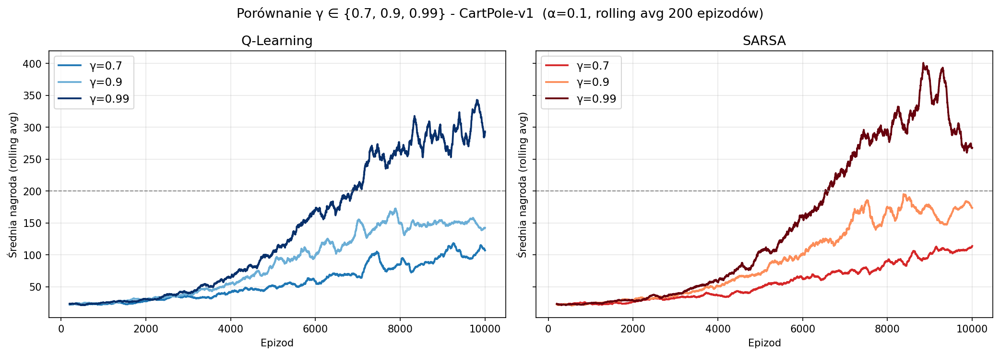
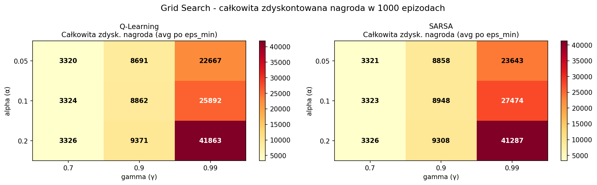
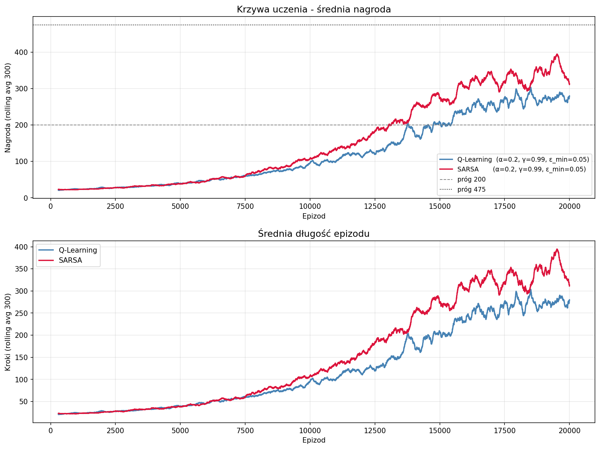

# Sprawozdanie - Projekt 3: Podstawy Gymnasium, zadania na 6 i 8 punktów
## CartPole-v1: Q-Learning vs SARSA w ciągłej przestrzeni obserwacji

---

## 1. Środowisko

Do realizacji zadań na 6 i 8 punktów wybrano środowisko **CartPole-v1** z biblioteki Gymnasium. Zadaniem agenta jest utrzymanie drążka w pionie poprzez przesuwanie wózka w lewo lub w prawo. Epizod kończy się, gdy drążek odchyli się o więcej niż ~12°, wózek wyjdzie poza granice toru, lub po osiągnięciu 500 kroków - co jest jednocześnie maksymalną nagrodą do zdobycia.

### Przestrzeń obserwacji

CartPole-v1 posiada **ciągłą** przestrzeń obserwacji $\mathbb{R}^4$, co stanowi zasadnicza różnicę względem środowisk dyskretnych jak Frozen Lake. Każdy stan opisany jest czterema zmiennymi rzeczywistymi:

| Indeks | Zmienna | Zakres |
|---|---|---|
| 0 | Pozycja wózka $x$ | $[-4.8, 4.8]$ |
| 1 | Prędkość wózka $\dot{x}$ | $(-\infty, +\infty)$ |
| 2 | Kąt drążka $\theta$ | $[-0.419, 0.419]$ rad |
| 3 | Prędkość kątowa drążka $\dot{\theta}$ | $(-\infty, +\infty)$ |

Przestrzeń akcji jest dyskretna i zawiera dwie możliwości: pchnięcie wózka w lewo (0) lub w prawo (1). Za każdy krok, w którym drążek pozostaje w pionie, agent otrzymuje nagrodę równą 1.

### Dyskretyzacja przestrzeni stanów

Algorytmy Q-Learning i SARSA w podstawowej formie wymagają skończonej przestrzeni stanów, dlatego ciągłą przestrzeń obserwacji poddano dyskretyzacji przy użyciu równomiernych koszyków (ang. *bins*). Dla każdego wymiaru zdefiniowano przedziały o granicach dobranych do typowych wartości przyjmowanych podczas gry:

- Pozycja wózka: 8 koszyków w przedziale $[-2.4, 2.4]$
- Prędkość wózka: 10 koszyków w przedziale $[-2.5, 2.5]$
- Kąt drążka: 16 koszyków w przedziale $[-0.2095, 0.2095]$ rad
- Prędkość kątowa: 16 koszyków w przedziale $[-2.8, 2.8]$

Daje to łącznie $8 \times 10 \times 16 \times 16 \times 2 = 40\,960$ wartości w tablicy Q. Kąt drążka i prędkość kątowa otrzymały największą rozdzielczość, ponieważ mają kluczowe znaczenie dla kontroli równowagi.

---

## 2. Algorytmy

Oba algorytmy opierają się na tej samej tablicy Q i procesie uczenia ε-greedy z liniowym harmonogramem zanikania ε - od 1.0 (pełna eksploracja) do wartości minimalnej.

### Q-Learning (off-policy)

Q-Learning jest algorytmem uczenia ze wzmocnieniem typu *off-policy*, co oznacza, że aktualizuje wartości Q w kierunku optymalnej (zachłannej) polityki niezależnie od tego, jaką akcję faktycznie wykonał agent podczas eksploracji. Reguła aktualizacji:

$$Q(s, a) \leftarrow Q(s, a) + \alpha \left[ r + \gamma \max_{a'} Q(s', a') - Q(s, a) \right]$$

Dzięki użyciu $\max_{a'} Q(s', a')$ agent zawsze uczy się, jaka byłaby najlepsza możliwa akcja - nawet jeśli w danym kroku wybrał inną (eksploracyjną).

### SARSA (on-policy)

SARSA (State–Action–Reward–State–Action) jest algorytmem *on-policy* - aktualizuje Q w kierunku akcji, którą faktycznie zamierza wykonać w następnym kroku zgodnie z bieżącą polityką ε-greedy:

$$Q(s, a) \leftarrow Q(s, a) + \alpha \left[ r + \gamma Q(s', a') - Q(s, a) \right]$$

gdzie $a'$ jest wybrane przez tę samą politykę ε-greedy, która steruje agentem. Oznacza to, że SARSA "wie" o własnej eksploracji i uwzględnia ją w aktualizacjach - jest przez to ostrożniejszy, ale też bardziej wierny swojemu rzeczywistemu zachowaniu podczas treningu.

---

## 3. Porównanie współczynników dyskontowych

Przeprowadzono eksperymenty z trzema wartościami współczynnika dyskontowego γ ∈ {0.7, 0.9, 0.99} przy stałych pozostałych parametrach (α = 0.1, ε_min = 0.02, 10 000 epizodów).

### Wyniki

| Algorytm | γ = 0.7 | γ = 0.9 | γ = 0.99 |
|---|---|---|---|
| Q-Learning (avg ostatnie 500 epiz.) | 103.0 | 148.4 | **314.7** |
| SARSA (avg ostatnie 500 epiz.) | 109.9 | 175.4 | **273.5** |

### Wnioski

Wyniki jednoznacznie wskazują, że **wyższy współczynnik dyskontowy prowadzi do lepszych rezultatów** w środowisku CartPole-v1. Różnice są bardzo wyraźne - Q-Learning z γ = 0.99 osiąga średnią nagrodę ponad trzykrotnie wyższą niż z γ = 0.7.

Intuicja jest następująca: celem agenta w CartPole jest przetrwanie jak najdłużej, a nagroda za każdy krok jest taka sama i wynosi 1. Przy niskim γ = 0.7 nagroda za krok oddalony o 10 kroków jest ważona czynnikiem $0.7^{10} \approx 0.028$ - agent praktycznie "nie widzi" dalszej przyszłości i nie ma silnego bodźca do uczenia się strategii długoterminowego utrzymania równowagi. Przy γ = 0.99 ta sama nagroda waży $0.99^{10} \approx 0.905$, co motywuje agenta do myślenia w horyzoncie setek kroków.

Wartość γ = 0.9 daje wyniki pośrednie, co potwierdza, że jest to rozsądny kompromis dla prostszych zadań, ale w CartPole - gdzie sukces mierzy się długością całego epizodu - najlepiej sprawdza się maksymalne myślenie długoterminowe.

---

## 4. Optymalizacja hiperparametrów

Aby wybrać najlepszą konfigurację do finalnego porównania, przeprowadzono przeszukiwanie siatki (ang. *grid search*) po 18 kombinacjach:

- α ∈ {0.05, 0.1, 0.2}
- γ ∈ {0.7, 0.9, 0.99}
- ε_min ∈ {0.01, 0.05}

**Kryterium optymalizacji**: całkowita zdyskontowana nagroda w pierwszych 1000 epizodach. W CartPole, gdzie każdy krok daje nagrodę 1, zdyskontowany return epizodu o długości $T$ wynosi:

$$G = \sum_{t=0}^{T-1} \gamma^t = \frac{1 - \gamma^T}{1 - \gamma}$$

Łącznie przeprowadzono 36 niezależnych treningów (18 kombinacji × 2 algorytmy).

### Wyniki grid search

| Ranking | α | γ | ε_min | Q-L metryka | SARSA metryka |
|---|---|---|---|---|---|
| 1 | 0.20 | 0.99 | 0.05 | **42 724** | **41 952** |
| 2 | 0.20 | 0.99 | 0.01 | 41 001 | 40 623 |
| 3 | 0.10 | 0.99 | 0.01 | 28 434 | 28 762 |
| 4 | 0.10 | 0.99 | 0.05 | 23 350 | 26 187 |
| 5 | 0.05 | 0.99 | 0.05 | 23 341 | 22 663 |

Wyniki potwierdzają dominację γ = 0.99 - wszystkie pięć najlepszych konfiguracji używa tej właśnie wartości. W obrębie γ = 0.99 wyższe α = 0.2 dało lepsze wyniki niż α = 0.1, co sugeruje, że szybsza aktualizacja wartości Q jest korzystna we wczesnej fazie uczenia. Dla obu algorytmów wybrano tę samą optymalną konfigurację: **α = 0.2, γ = 0.99, ε_min = 0.05**.

---

## 5. Finalne porównanie algorytmów

Oba algorytmy wytrenowano z najlepszymi hiperparametrami przez 20 000 epizodów.

### Krzywe uczenia

Krzywe uczenia pokazują, że oba algorytmy startują podobnie i przez pierwsze ~8 000 epizodów rozwijają się w porównywalnym tempie. Od epizodu ~10 000 SARSA zaczyna rosnąć szybciej - w ostatnich 2 000 epizodach treningu osiąga średnią nagrodę 338 wobec 274 dla Q-Learning.

### Ewaluacja zachłannej polityki

Po zakończeniu treningu każdy model oceniono w 300 epizodach z polityką w pełni zachłanną (ε = 0):

| Metryka | Q-Learning | SARSA |
|---|---|---|
| Średnia nagroda | **331.79** | 286.86 |
| Śr. nagroda zdyskontowana (γ=0.99) | **93.70** | 92.28 |
| Sukces ≥ 475 kroków | **18.0%** | 4.3% |
| Sukces ≥ 200 kroków | **86.7%** | 81.7% |
| Min nagroda | 120.0 | 124.0 |
| Max nagroda | 500.0 | 500.0 |
| Czas treningu | 250.6 s | 301.5 s |

### Interpretacja wyników

Wyniki ujawniają ciekawą asymetrię między algorytmami. **Podczas treningu SARSA osiągał wyższe nagrody** (avg ostatnie 500 epizodów: 321 vs 284), jednak **w ewaluacji zachłannej wygrał Q-Learning** (331 vs 286, oraz 18% vs 4.3% przy surowym progu 475 kroków).

Wyjaśnienie leży w fundamentalnej różnicy między obiema metodami. SARSA jest algorytmem on-policy - uczy się wartości Q odpowiadających polityce ε-greedy, a nie polityce w pełni zachłannej. Przy ε_min = 0.05 agent nadal losowo eksploruje w 5% kroków, co "zaburza" wyuczone wartości Q. Gdy podczas ewaluacji wyłączymy eksplorację i agent działa w pełni zachłannie, Q-table wyuczona przez SARSA okazuje się mniej dobrze skalibrowana dla tego trybu działania.

Q-Learning z kolei, jako metoda off-policy, przez cały trening aktualizuje Q w kierunku optymalnego (zachłannego) zachowania - niezależnie od tego, czy w danym kroku wybrał akcję eksploracyjną. Dzięki temu jego Q-table lepiej opisuje wartości dla polityki w pełni zachłannej.

Q-Learning okazał się też szybszy w treningu (250 s vs 301 s), ponieważ SARSA - lepiej uczący się podczas fazy eksploracyjnej - generował dłuższe epizody i tym samym więcej kroków do obliczenia.

---

## 6. Wnioski

Przeprowadzone eksperymenty pozwalają sformułować następujące wnioski:

1. **Dyskretyzacja przestrzeni ciągłej** skutecznie pozwala zastosować tabelaryczne algorytmy RL (Q-Learning, SARSA) do środowisk z ciągłą przestrzenią obserwacji. Wybór odpowiedniej rozdzielczości koszyków ma istotne znaczenie dla jakości aproksymacji.

2. **Współczynnik dyskontowy γ jest najważniejszym hiperparametrem** w CartPole-v1. Różnica między γ = 0.7 a γ = 0.99 jest ponad trzykrotna pod względem osiąganej nagrody. Środowisko nagradza długoterminowe myślenie, więc wysoka gamma jest tu naturalnym wyborem.

3. **Q-Learning lepiej sprawdza się w ewaluacji zachłannej** dzięki swojej naturze off-policy - optymalizuje wartości Q pod kątem polityki greedy nawet podczas eksploracji. SARSA może osiągać lepsze wyniki mierzone w czasie treningu, ale wypracowana polityka jest bardziej "zoptymalizowana pod siebie" - to znaczy pod politykę ε-greedy, a nie czysto zachłanną.

4. **Optymalne hiperparametry** - α = 0.2, γ = 0.99, ε_min = 0.05 - okazały się jednakowe dla obu algorytmów, co sugeruje, że w tym środowisku ważniejszy jest dobór gamma niż specyfika metody aktualizacji.
