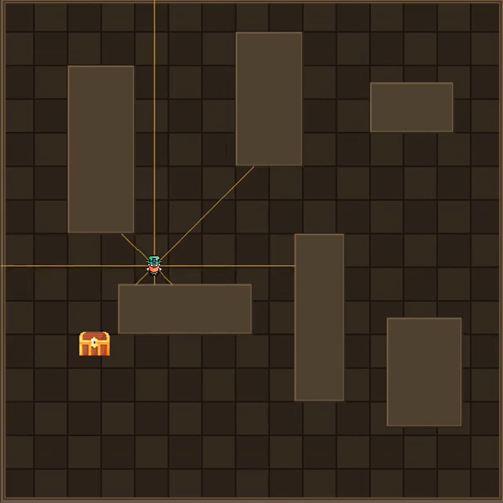
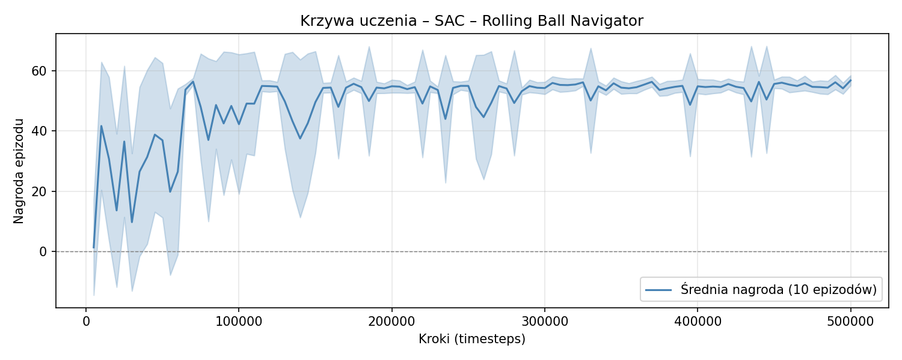

# Sprawozdanie – Projekt 4: Własne środowisko Gymnasium
## Rolling Ball Navigator

**Autorzy:** Patrick Bajorski, Jan Banasik

**Data:** 06.05.2026

---

## 1. Środowisko

### 1.1 Opis problemu

Zaimplementowano środowisko **Rolling Ball Navigator** - kulka poruszająca się po prostokątnej planszy musi dotrzeć do losowo wyznaczonego celu, omijając po drodze statyczne przeszkody prostokątne. Środowisko zostało zaimplementowane zgodnie ze standardowym interfejsem Gymnasium (metody `reset`, `step`, `render`, `close`), z ciągłą przestrzenią obserwacji i akcji.

Plansza ma wymiary 600×600 pikseli i zawiera 6 statycznych przeszkód prostokątnych tworzących nietrywialny układ wymagający aktywnego omijania. Na początku każdego epizodu pozycja startowa kulki oraz pozycja celu są losowane niezależnie w obszarach wolnych od przeszkód, w odległości co najmniej 100 pikseli od siebie.

### 1.2 Fizyka ruchu

W każdym kroku czasowym prędkość kulki jest aktualizowana zgodnie z uproszczoną fizyką newtonowską (w kodzie dodatkowo stosowane jest twarde ograniczenie prędkości do `±V_MAX` po dodaniu przyspieszenia):

```
vel  = clip(vel + action * FORCE_SCALE, -V_MAX, V_MAX)   # (FORCE_SCALE = 0.4, V_MAX = 8)
vel  *= FRICTION                 # (FRICTION = 0.92, tłumienie prędkości)
pos  += vel
```

Przy zderzeniu ze ścianą planszy lub przeszkodą prostokątną odpowiednia składowa prędkości zmienia znak (sprężyste odbicie), a pozycja kulki jest korygowana o wartość nakładania. Stałe `BALL_RADIUS = 12` i `GOAL_RADIUS = 18` definiują rozmiary obiektów.

### 1.3 Przestrzeń obserwacji

Obserwacja jest ciągłym wektorem 13 liczb zmiennoprzecinkowych (`spaces.Box`, `dtype=float32`). Wszystkie wartości są znormalizowane do zakresu `[-1, 1]` lub `[0, 1]`:

| Indeks | Opis | Zakres |
|--------|------|--------|
| 0–1 | Prędkość kulki (x, y) / `V_MAX` | `[-1, 1]` |
| 2–3 | Znormalizowany kierunek do celu (x, y) | `[-1, 1]` |
| 4 | Odległość do celu / przekątna planszy | `[0, 1]` |
| 5–12 | 8 sensorów odległości (raycasting, co 45°) / `RAY_MAX` | `[0, 1]` |

Agent nie zna swojej pozycji absolutnej na planszy - nawiguje wyłącznie na podstawie lokalnych informacji. Sensory odległości (raycasting metodą slab AABB) wykrywają zarówno ściany planszy, jak i przeszkody prostokątne, dając agentowi możliwość „wyczucia" otoczenia bez dostępu do mapy.

### 1.4 Przestrzeń akcji

Akcja jest ciągłym wektorem dwuwymiarowym (`spaces.Box`, `[-1, 1]²`), reprezentującym siłę przykładaną do kulki w osiach X i Y. Brak dyskretyzacji kierunków daje agentowi pełną swobodę sterowania.

### 1.5 Funkcja nagrody

Zastosowana funkcja nagrody łączy kształtowanie gęste z nagrodą końcową:

```
nagroda = -0.01 + 0.02 * (poprzednia_dist - aktualna_dist)
jeśli cel osiągnięty: nagroda += 50.0
```

Składnik `-0.01` na krok motywuje agenta do szybkości. Składnik `0.02 * Δdist` to gęste kształtowanie nagrody - agent otrzymuje proporcjonalny sygnał za każde zbliżenie się do celu w danym kroku, co eliminuje problem rzadkiej nagrody. Nagroda `+50.0` za dotarcie do celu stanowi silny sygnał końcowy.

### 1.6 Warunki zakończenia epizodu

Epizod kończy się sukcesem (`terminated=True`), gdy środek kulki znajdzie się w promieniu `GOAL_RADIUS + BALL_RADIUS` od celu. Przekroczenie limitu `MAX_STEPS = 500` kroków kończy epizod przez timeout (`truncated=True`).

### 1.7 Tryb graficzny

Środowisko implementuje metodę `render()` obsługującą dwa tryby:

- `"human"` - interaktywne okno pygame do obserwacji działania agenta w czasie rzeczywistym
- `"rgb_array"` - zwracana macierz pikseli, wykorzystana w notebooku do zapisu nagrania epizodów (plik `episode.mp4`)

W trybie graficznym renderowane są: plansza (tekstura kafelkowa), przeszkody, sprite kulki (`sprites/agent.png`), sprite celu (`sprites/goal.png`) oraz jasne linie (złotawy kolor) reprezentujące promienie sensorów odległości.



---

## 2. Algorytm uczenia

### 2.1 Wybór algorytmu

Do treningu agenta zastosowano algorytm **SAC (Soft Actor-Critic)** z biblioteki `stable-baselines3`. SAC jest algorytmem off-policy opartym na maksymalizacji entropii - optymalizuje zarówno oczekiwaną nagrodę, jak i entropię polityki, co sprzyja eksploracji i zapobiega przedwczesnemu zbieganiu do lokalnych minimów. Jest to algorytm szczególnie dobrze dopasowany do ciągłych przestrzeni akcji, w których metody on-policy jak PPO wymagają znacznie większej liczby próbek.

### 2.2 Hiperparametry

| Parametr | Wartość | Uzasadnienie |
|----------|---------|--------------|
| `learning_rate` | `3e-4` | Standardowa wartość dla SAC z sieciami MLP |
| `buffer_size` | `300 000` | Replay buffer pokrywający >50% całego treningu |
| `learning_starts` | `5 000` | Zbieranie danych losowych przed pierwszą aktualizacją |
| `batch_size` | `256` | Dobry balans między wariancją gradientu a szybkością |
| `gamma` | `0.99` | Duże znaczenie przyszłych nagród - cel może być wiele kroków od startu |
| `ent_coef` | `0.1` (stały) | Ustalony ręcznie - patrz sekcja 3.2 |
| `total_timesteps` | `500 000` | ~50 minut na GPU (CUDA) |

---

## 3. Eksperymenty

### 3.1 Problem rzadkiej nagrody

W pierwszej wersji środowiska nagroda za dotarcie do celu wynosiła `+10`, kara za krok `-0.01`, a limit epizodu wynosił 1000 kroków. Łączna kara za timeout (1000 × 0.01 = 10.0) dokładnie równoważyła nagrodę końcową - agent był więc obojętny na dotarcie do celu. Trening przez 500 000 kroków nie przyniósł żadnego postępu (`ep_rew_mean ≈ -10` przez cały czas).

**Zastosowane poprawki:** podniesienie nagrody za cel do `+50`, skrócenie epizodów do `MAX_STEPS = 500` oraz wprowadzenie gęstego kształtowania nagrody `0.005 * Δdist`.

### 3.2 Niestabilność treningu - nienormalizowane obserwacje i auto-tuning entropii

Po poprawkach z sekcji 3.1 trening ruszył, jednak zaobserwowano nieprawidłowe zachowanie: `ent_coef` rósł stopniowo z 0.1 do wartości powyżej 3.0, a `critic_loss` wynosił ~249. Diagnozy ujawniły dwie powiązane przyczyny:

1. **Nienormalizowane obserwacje** - wektory obserwacji zawierały wartości z bardzo różnych zakresów (np. odległość do celu mogła wynosić ~848 pikseli, podczas gdy prędkości były rzędu ±5). Taka dysproporcja powoduje, że gradienty sieci krytyka są zdominowane przez największe wartości, co prowadzi do wysokiego `critic_loss` i niestabilnego uczenia.

2. **Auto-tuning entropii** - domyślny mechanizm SAC automatycznie dostosowuje `ent_coef`, dążąc do docelowej entropii. W warunkach niestabilnego krytyku mechanizm ten nakręcał entropię polityki zamiast ją stabilizować, co prowadziło do coraz bardziej losowego zachowania agenta.

**Zastosowane poprawki:** pełna normalizacja wszystkich 13 obserwacji do zakresów `[-1, 1]` lub `[0, 1]` oraz ustawienie `ent_coef=0.1` jako stałej wartości (wyłączenie auto-tuningu). Po tych zmianach `critic_loss` spadł poniżej 0.01.

### 3.3 Zamrażanie agenta w pobliżu ścian i przeszkód

W kolejnej iteracji znaczna część epizodów kończyła się timeoutem, bo agent po prostu pozostawał nieruchomy blisko ściany lub przeszkody. Przyczyną było stosowanie kary `-0.1` za każde zderzenie. Kumulatywna kara za aktywne poruszanie się i wielokrotne zderzenia (np. przy próbie ominięcia przeszkody) była wyższa niż kara za bezczynność (-0.01/krok). Agent odkrył, że strategia „stój w miejscu" minimalizuje karę.

**Zastosowane poprawki:** całkowite usunięcie kary za zderzenie - fizyczne odbicie jest wystarczającą konsekwencją. Jednocześnie wzmocniono kształtowanie nagrody z `0.005` do `0.02 * Δdist`, żeby sygnał w kierunku celu był silniejszy od kary za czas.

---

## 4. Wyniki

### 4.1 Krzywa uczenia



Przełom w uczeniu nastąpił stosunkowo wcześnie - już około 65 000 kroków nagroda ewaluacyjna osiągnęła ~54 z niską wariancją (±1.9). Pozostałe ~430 000 kroków pozwoliło na dopracowanie polityki i zmniejszenie średniej liczby kroków do celu.

W pierwszych 60 000 krokach widoczne są duże oscylacje nagrody ewaluacyjnej, co jest typowe dla fazy eksploracji SAC - bufor powtórzeń jest jeszcze niepełny, a polityka dopiero się kształtuje.

### 4.2 Ewaluacja finalnego modelu

Model deterministyczny oceniono na 30 niezależnych epizodach z losowymi pozycjami startowymi:

| Metryka | Wartość |
|---------|---------|
| Skuteczność (dotarcie do celu) | **100.0%** (30/30) |
| Średnia nagroda | 54.90 ± 1.56 |
| Średnia liczba kroków | 123.3 ± 76.2 |
| Maks. dostępne kroki | 500 |

Agent konsekwentnie osiąga cel w średnio ~123 krokach (25% dostępnego limitu), co wskazuje na aktywną strategię nawigacji, a nie przypadkowe poszukiwanie. Niskie odchylenie standardowe nagrody (±1.56) świadczy o stabilności wyuczonej polityki. Zmienność liczby kroków (±76.2) wynika z losowości pozycji startowych - epizody z celem odległym o ponad 500 pikseli wymagają dłuższej trajektorii niż te z bliskim celem.

---

## 5. Wnioski

Przeprowadzone eksperymenty ilustrują kilka praktycznych kwestii w uczeniu ze wzmocnieniem:

1. **Gęste kształtowanie nagrody jest niezbędne** przy zadaniach, gdzie rzadka nagroda końcowa jest trudna do odkrycia. Sygnał `0.02 * Δdist` w każdym kroku umożliwił szybką konwergencję.

2. **Normalizacja obserwacji ma krytyczne znaczenie** dla stabilności treningu z sieciami neuronowymi. Niezbalansowane skale wejść prowadzą do wysokiego `critic_loss` i niestabilnego auto-tuningu entropii.

3. **Funkcja nagrody może prowadzić do niepożądanych zachowań** - kara za zderzenia, choć intuicyjnie sensowna, stworzyła bodziec do całkowitej bezczynności. Poprawna konstrukcja nagrody wymaga analizy strategii, które ona faworyzuje, nie tylko tych, które miała penalizować.

4. **SAC z wyłączonym auto-tuningiem entropii** (`ent_coef=0.1`) okazał się bardziej stabilny w tym środowisku niż wariant z automatyczną regulacją, gdzie mechanizm dostosowywania entropii wchodził w pętlę sprzężenia zwrotnego z niestabilnym krytykiem.
