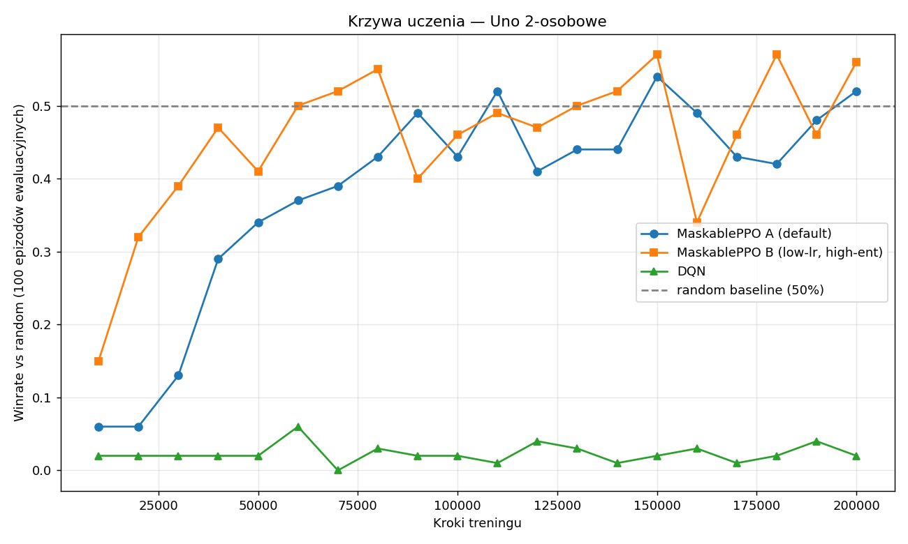
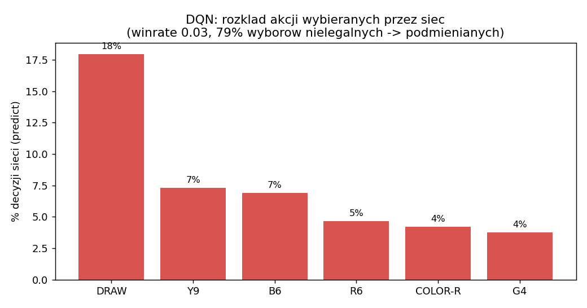
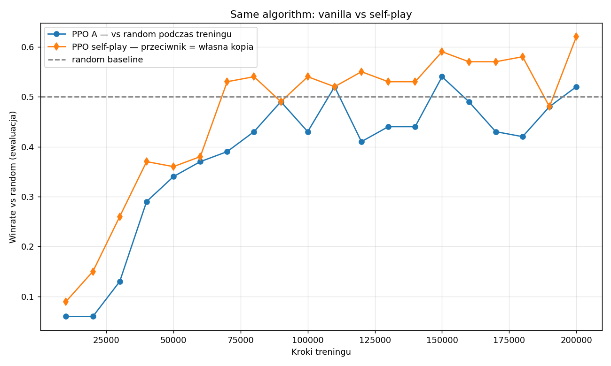
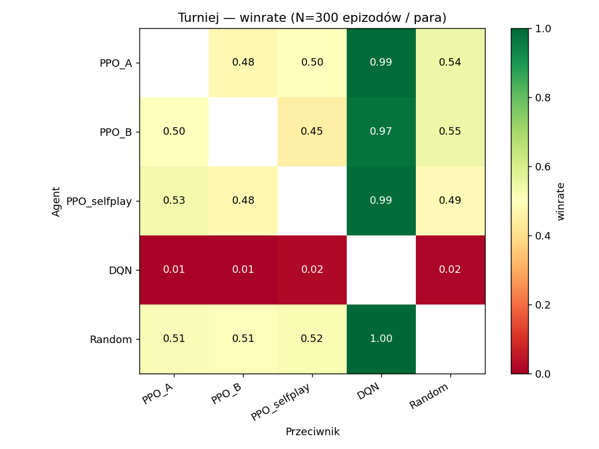

# Sprawozdanie — Projekt 6: Problem wieloagentowy (Uno, 2 graczy)

**Autorzy:** Patrick Bajorski, Jan Banasik  
**Przedmiot:** Inteligencja obliczeniowa w analizie danych cyfrowych  
**Data:** 1 czerwca 2026

---

**Środowisko:** własna implementacja gry karcianej **Uno** dla 2 graczy (zadanie na 8 punktów)  
**Algorytmy:** MaskablePPO (2 warianty hiperparametrów) + DQN — Stable Baselines 3 / sb3-contrib  
**Eksperymenty:** krzywe uczenia, self-play (ten sam algorytm), turniej (różne algorytmy)

---

## 1. Środowisko — Uno 2-osobowe

Zaimplementowałem od zera kompletny silnik gry Uno (`UnoGame`), niezależny od warstwy RL. Talia liczy **108 kart**: cztery kolory (R, Y, G, B), w każdym po jednej karcie „0" i po dwie karty 1–9 oraz karty specjalne **Skip, Reverse, +2** (100 kart kolorowych), a do tego **4× Wild** i **4× Wild+4** (16 kart czarnych). Karty kodowane są jednym intem 0–53.

Zasady zaimplementowane w silniku:

- rozdanie po 7 kart, dobieranie ze stosu, automatyczny **reshuffle** stosu odrzuconych, gdy talia się skończy;
- dopasowanie po **kolorze lub wartości**, karty Wild grywalne zawsze;
- karty specjalne: w grze 2-osobowej **Skip i Reverse** działają tak samo — gracz zachowuje turę;
- **+2 / Wild+4** nakładają dług dobrania (`draw_debt`), z możliwością **łańcuchowania** (odbicie +2 kartą +2, Wild+4 kartą Wild+4 — wariant „house rule");
- wybór koloru po zagraniu karty Wild (osobne akcje).

**Przestrzeń akcji** ma 59 wartości: 54 = zagranie konkretnego typu karty, 1 = dobranie / przyjęcie długu, 4 = wybór koloru po Wild. **Obserwacja** to wektor **170-wymiarowy** z perspektywy gracza: liczność kart na ręce (54), karta wierzchnia one-hot (54), aktywny kolor (4), licznik kart już zagranych (54) oraz 4 cechy skalarne (rozmiar ręki przeciwnika, dług dobrania, flaga wyboru koloru, flaga „moja tura").

Kluczowym mechanizmem jest **maska legalnych akcji** (`legal_actions`) — w każdym stanie tylko część z 59 akcji jest dozwolona. Maskowanie akcji jest typowe dla gier karcianych i, jak pokazują wyniki, decyduje o tym, czy algorytm w ogóle potrafi się uczyć.

Test poprawności silnika (1000 losowych partii): brak błędów, wyniki zrównoważone (P0/P1 ≈ 493/507), średnia długość partii ~66 tur — gra kończy się zawsze, bez zawieszeń.

## 2. Architektura RL — gra 2-osobowa jako środowisko single-agent

Uno jest naturalnie środowiskiem naprzemiennym (AEC). Aby użyć standardowych algorytmów z SB3, opakowałem grę w `UnoGymEnv` (zgodny z Gymnasium), gdzie:

- trenowany agent gra z perspektywy jednego z graczy (losowanego na początku epizodu, by uniknąć biasu pierwszego ruchu);
- **przeciwnik gra zadaną polityką** (`opponent_policy`) — można ją wymieniać: losowy gracz, wytrenowany model, kopia samego siebie;
- po ruchu agenta środowisko automatycznie odgrywa ruchy przeciwnika aż do kolejnej tury agenta.

Dzięki temu ten sam kod środowiska obsługuje trening vs random, self-play i turniej między modelami. Jako **bazowy przeciwnik** stosuję „smart-random": gra losowo, ale nie dobiera, gdy może zagrać kartę — to znacznie silniejszy i bardziej realistyczny przeciwnik niż czysto losowy.

Nagroda jest rzadka i terminalna: **+1** za wygraną (opróżnienie ręki), **−1** za przegraną, 0 w pozostałych krokach.

## 3. Algorytmy i konfiguracja

| Model | Algorytm | Kluczowe hiperparametry |
|---|---|---|
| **PPO_A** | MaskablePPO | `lr=3e-4`, `n_steps=2048`, `n_epochs=10`, `ent_coef=0.01` (domyślne) |
| **PPO_B** | MaskablePPO | `lr=1e-4`, `n_steps=512`, `n_epochs=4`, `ent_coef=0.05` (więcej eksploracji) |
| **DQN** | DQN | `lr=1e-4`, `buffer=100k`, `exploration_fraction=0.3` |

**MaskablePPO** (sb3-contrib) natywnie wykorzystuje maskę legalnych akcji — sieć nigdy nie próbuje zagrać karty, której nie ma. **DQN** nie wspiera maskowania; gdy wskaże akcję nielegalną, środowisko podmienia ją na losową legalną. Każdy model trenowany jest przez **200 000 kroków**, z ewaluacją winrate co 10 000 kroków (100 epizodów vs random). To spełnia wymóg na 6 punktów: **dwa różne algorytmy, jeden (PPO) w dwóch wariantach hiperparametrów.**

## 4. Krzywe uczenia (4 i 6 pkt)

**Obserwacje:**

- **PPO się uczy.** PPO_A i PPO_B startują nisko (~0.05–0.15 winrate) i rosną do plateau **~0.5–0.56** vs smart-random — czyli osiągają poziom silnego przeciwnika heurystycznego.
- **PPO_B uczy się szybciej.** Wariant z niższym `lr` i wyższym `ent_coef` osiąga poziom ~0.5 już ok. 40k kroków (PPO_A dopiero ~90k) i finalnie jest minimalnie wyżej (**0.56 vs 0.52**). W tej grze z rzadką nagrodą **większa eksploracja pomogła** — agent szybciej odkrywa, że nie warto dobierać bez potrzeby.
- **DQN nie uczy się w ogóle** — krzywa leży płasko na **~0.02**, czyli **gorzej niż losowy gracz**.

Skoki na krzywych (±0.1) wynikają częściowo ze stochastycznej ewaluacji polityki PPO (`deterministic=False`) i ograniczonej liczby 100 epizodów na punkt — Uno jest grą o dużej wariancji.

### Dlaczego DQN zawodzi — diagnostyka

Diagnostyka wytrenowanego DQN (200 epizodów, ewaluacja deterministyczna) ujawnia mechanizm porażki: **~79% akcji wskazywanych przez sieć jest nielegalnych** i zostaje podmienionych na losowe legalne. Polityka jest więc faktycznie **odłączona od gry** — wyuczone Q-wartości nie odpowiadają akcjom realnie wykonywanym, co łamie spójność równania Bellmana. Dodatkowo najczęściej wskazywaną pojedynczą akcją jest `DRAW` (18% wyborów sieci); po podmianach **~45% faktycznie wykonanych akcji to dobieranie**, więc agent gromadzi karty i niemal nigdy nie opróżnia ręki (winrate 0.025). Wniosek: **w grach karcianych maskowanie akcji jest warunkiem koniecznym** — to nie tyle „DQN jest słaby", co „DQN bez maskowania w tej przestrzeni akcji nie działa".

## 5. Ten sam algorytm vs różne algorytmy (6 pkt)

### 5a. Self-play — wszyscy agenci tym samym algorytmem

Wytrenowałem dodatkowy MaskablePPO w trybie **self-play**: przeciwnikiem jest zamrożona kopia samego siebie, aktualizowana co 25k kroków. Oba agenty w epizodzie używają więc tego samego algorytmu i architektury.

PPO self-play osiąga **0.62 winrate vs random** w ewaluacji z krzywej uczenia — najwyżej ze wszystkich modeli i wyraźnie powyżej zwykłego PPO_A (0.52). Od ~70k kroków krzywa self-play konsekwentnie leży nad krzywą vanilla. Interpretacja: trening przeciw **coraz silniejszym kopiom samego siebie** wymusza bardziej odporną politykę niż trening przeciw stałemu (smart-random) przeciwnikowi — agent nie przeucza się pod jeden styl gry. Warto jednak zaznaczyć, że ta przewaga jest niestabilna: w niezależnym turnieju (sekcja 5b, inny zestaw partii) ten sam model uzyskuje już tylko ~0.49 przeciw random — różnica mieści się w granicach wariancji tej gry.

### 5b. Turniej — różne algorytmy w tym samym epizodzie

Każda para modeli rozegrała 300 partii (winrate wiersza vs kolumna):

Ranking siły (średni winrate w turnieju):

| Pozycja | Model | Średni winrate |
|---|---|---|
| 1 | Random | **0.633** |
| 2 | PPO_A | 0.628 |
| 3 | PPO_selfplay | 0.621 |
| 4 | PPO_B | 0.617 |
| 5 | DQN | 0.014 |

**Obserwacje:**

- **Każdy miażdży DQN ~0.97–1.00**, a DQN nie wygrywa z nikim — nawet z losowym graczem (0.017). To jedyny duży, jednoznaczny efekt w całym turnieju.
- **Wśród kompetentnych agentów (3× PPO + smart-random) winrate'y kłębią się w okolicy 0.45–0.55** — różnice są w granicach szumu. Znamienne, że **smart-random jest nominalnie na szczycie rankingu** (0.51–0.52 przeciw każdemu wariantowi PPO), a PPO_selfplay przegrywa z nim minimalnie (0.49). Macierz jest spójna (wartości symetryczne sumują się do ~1.0, praktycznie brak remisów).
- Wynik ten dobitnie pokazuje, że **w 2-osobowym Uno przewaga „umiejętności" nad silnym graczem heurystycznym jest minimalna** — o rezultacie pojedynczej partii decyduje głównie rozdanie. Drobne różnice w rankingu między PPO a random nie są istotne statystycznie przy 300 partiach na parę.

## 6. Wnioski

1. **Maskowanie akcji jest kluczowe.** MaskablePPO uczy się sensownej gry; DQN bez maskowania degeneruje się do gracza słabszego niż losowy (80% wskazań nielegalnych). To najważniejszy, jednoznaczny wynik porównania algorytmów.
2. **Self-play pomaga, ale efekt jest słaby.** PPO w self-play osiąga najwyższy winrate vs random w ewaluacji z krzywej uczenia (0.62 vs 0.52 dla PPO_A), co sugeruje, że bardziej zróżnicowany przeciwnik daje odporniejszą politykę. W niezależnym turnieju ta przewaga jednak zanika (self-play ~0.49 z random) — przy dużej wariancji Uno nie udało się jej potwierdzić jako trwałej.
3. **Hiperparametry mają znaczenie.** Wariant PPO_B (większa eksploracja, mniejszy `lr`) uczy się szybciej i nieco skuteczniej niż wariant domyślny.
4. **Uno 2-osobowe jest grą mocno losową.** Sufit przewagi „umiejętności" jest niski — silny baseline smart-random sprawia, że trenowane PPO przekracza go tylko nieznacznie. To uczciwa cecha problemu, nie wada implementacji: ograniczona obserwowalność (nie znamy ręki przeciwnika) i wysoka wariancja rozdań ograniczają możliwą do uzyskania przewagę.

### Ograniczenia i możliwe rozszerzenia

- Brak reguły „Uno!" i kar za jej niewywołanie; brak wymuszania zagrania dobranej karty.
- Nagroda wyłącznie terminalna — można dodać kształtowanie nagrody (np. za zmniejszanie ręki) dla gęstszego sygnału.
- DQN można by uczciwie naprawić wariantem z maskowaniem Q-wartości (maskowanie nielegalnych akcji przed `argmax`).
- Dłuższy trening i większa liczba epizodów ewaluacyjnych zmniejszyłyby szum krzywych.

---

*Wszystkie wykresy wygenerowane przez notebook `uno_multiagent.ipynb`. Logi treningowe (policy/value loss, entropia) dostępne w `tb_logs/` przez TensorBoard.*
